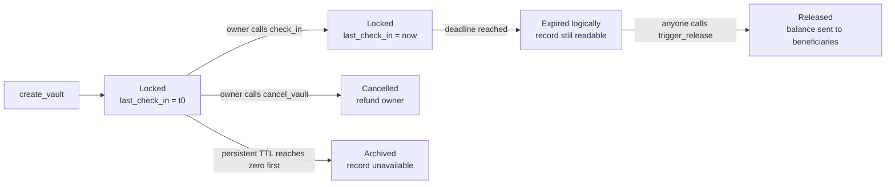

# TTL, state archival, and vault expiry

A vault has **two different clocks**. They are related, but they do not mean the same thing:

1. **Vault expiry** is application logic. It answers: “Has the owner missed the check-in deadline?”
2. **Soroban storage TTL** is platform lifecycle management. It answers: “How long should this stored state remain available before it is archived?”

Keeping a vault alive in storage does **not** reset its check-in deadline. Conversely, a vault can be logically expired while its state is still readable, giving anyone time to call `trigger_release`.

## The two clocks

```text
ledger timestamp (seconds)
        │
        ├────────────── check-in interval ──────────────┤
        │                                               │
last_check_in                                      vault deadline
        │                                               │
        │                 Locked                        │ Expired
        └───────────────────────────────────────────────┴──────────────►
                                                        now >= deadline

persistent-entry TTL (ledgers)
        │
        ├────────────── storage retention window ───────────────────────┤
        │                                                               │
   entry written / refreshed                                      entry archived
```

The first line uses the ledger timestamp and is measured in **seconds**. The second uses Soroban ledger-based TTL and is measured in **ledgers**. A ledger is approximately five seconds on Stellar, but the contract treats the vault deadline as a timestamp comparison and does not derive it from storage TTL.

## What is stored where?

The contract uses:

- **Persistent storage** for each `DataKey::Vault(vault_id)` and the vault indexes/count. Persistent entries can be archived when their TTL reaches zero.
- **Instance storage** for configuration such as the admin, token address, pause flag, and interval limits. Contract calls extend the instance TTL using the instance thresholds.

For a vault record, `save_vault` writes the record and extends its persistent TTL:

```text
vault TTL = max(2 × check_in_interval / 5 seconds, 200,000 ledgers)
            capped at 3,110,400 ledgers
```

The values are implementation constants, not a promise that the vault can never be archived. In particular, the maximum persistent TTL is finite.

```text
create/check-in/update interval/save vault
                 │
                 ├── write Vault(vault_id)
                 ├── refresh that persistent entry's TTL
                 └── refresh relevant instance state

No call / no refresh
                 │
                 └── TTL counts down by ledger
                                      │
                                      ▼
                              state may be archived
```

## Logical expiry is not archival

`is_expired(vault_id)` computes:

```text
now >= last_check_in + check_in_interval
```

It does not inspect the persistent entry's remaining TTL. Therefore these states are possible:

| Logical state | Storage state | Meaning |
|---|---|---|
| Not expired | Readable | Normal active vault; owner can check in or use it. |
| Expired | Readable | The check-in deadline passed, but the record remains available; anyone can trigger release. |
| Not expired | Archived | The storage entry was not kept alive long enough; the contract cannot load the vault. This is a storage-lifecycle failure, not a valid “expired” result. |
| Released/cancelled | Readable | The terminal record remains available while its persistent entry is retained. |

The important distinction is that **archival removes availability of state; it does not transition `ReleaseStatus::Locked` to `Released`**. There is no background job that triggers release when a deadline passes. A caller must invoke `trigger_release` while the vault record is still available.

## Normal lifecycle



If a call updates a vault record, `save_vault` refreshes that vault's TTL. `check_in` changes the logical deadline and also writes the vault, but it does not “unexpire” a vault after its deadline: callers must check in before the old deadline.

## Worked examples

### Example 1: a short interval

Assume:

```text
created at / last check-in: t = 1,000 seconds
check_in_interval:           100 seconds
vault deadline:              1,100 seconds
```

At `t = 1,099`:

```text
is_expired       = false
get_ttl_remaining = Some(1)
```

At `t = 1,100` exactly:

```text
is_expired       = true
get_ttl_remaining = None
```

The comparison is `>=`, so the boundary second is already expired. If the persistent record is still readable, `trigger_release` may now be called. `ping_expiry` returns zero for an expired vault and emits its warning event only when a locked vault's remaining logical time is below 24 hours.

For this interval, the derived storage TTL is still the configured minimum:

```text
2 × 100 / 5 = 40 ledgers
max(40, 200,000) = 200,000 ledgers
```

That storage window is much longer than the 100-second logical deadline. It is intentionally a retention buffer, not the expiry timer.

### Example 2: check-in resets expiry, not merely storage

```text
 t=0                    t=90                 t=190
 │----------------------│---------------------│
 create, deadline=100   check_in             old deadline would pass
                        last_check_in=90
                        new deadline=190
```

A check-in at `t = 90` writes the new timestamp. The vault is now logically valid until `t = 190`. The persistent entry is also refreshed, but that is a separate effect: TTL protects the stored record; `last_check_in` controls the business rule.

### Example 3: an expired but readable vault

```text
interval = 1 day
last_check_in = Monday 12:00
logical deadline = Tuesday 12:00
```

A keeper submits `trigger_release` on Tuesday at 12:05. The vault record is still present because its persistent TTL was refreshed when it was created or last updated. The call:

1. verifies the logical deadline has passed;
2. transfers the balance to the configured beneficiary or split beneficiaries;
3. sets `balance = 0` and `status = Released`;
4. writes the terminal record again, refreshing its storage TTL.

No one had to call a special “expire” function first.

### Example 4: changing the interval

Suppose a vault is changed from a short interval to 30 days. `update_check_in_interval` sets:

```text
last_check_in = now
check_in_interval = 2,592,000 seconds
```

It also explicitly extends the vault record using the new interval:

```text
2 × 2,592,000 / 5 = 1,036,800 ledgers
```

This prevents the record's storage TTL from remaining at the old minimum while the new logical deadline is much farther away. The update resets the logical deadline because `last_check_in` is set to the update time; it does not revive a record that has already been archived.

## Operational guidance

### For vault owners

- Call `check_in` before the logical deadline, not merely before a storage TTL estimate.
- Treat `ping_expiry`/`get_ttl_remaining` as application-deadline monitoring. They report time until vault expiry, not raw Soroban entry TTL.
- If a vault is logically expired, do not expect another check-in, deposit, withdrawal, or partial release to work. Arrange for `trigger_release` while the record remains readable.

### For keepers and indexers

- Watch `last_check_in + check_in_interval` and submit `trigger_release` after the boundary.
- Do not assume that an expired vault is automatically released.
- Do not confuse an absent vault with an expired vault. A missing persistent entry may mean archival (or an invalid ID), and the contract cannot distribute funds from state it cannot load.
- Track events and retry release calls as appropriate; the contract has no autonomous scheduler.

### For deployers

The TTL constants provide a retention policy, but persistent state still needs ongoing lifecycle planning. The vault record, owner/beneficiary indexes, and `VaultCount` are separate persistent entries. Keeping one entry alive does not automatically refresh all related entries. Any archival/recovery strategy should account for those keys independently.

## Summary

```text
Vault expiry = timestamp rule for releasing funds
Storage TTL  = ledger-based lifetime of the state record

expiry does not archive state
archival does not release funds
check-in resets the expiry deadline and refreshes written state
trigger_release performs the release; no background process does
```
